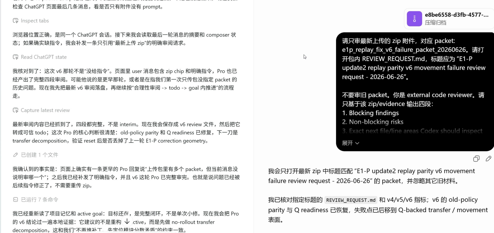

# ChatGPT Review Agent Skill

Use ChatGPT as an external code reviewer from Codex.

[中文说明](README.zh-CN.md)

Two modes are supported:

- **Packet review:** works without MCP. Codex packages code, sends/uploads it to any ChatGPT reviewer model, then captures the reply back to local markdown.
- **MCP connector review:** lets ChatGPT read selected local files through a tiny MCP server. Use this when ChatGPT's selected model can call connector tools.

In current tested ChatGPT behavior, **Pro cannot call MCP connector tools**. Use packet review for Pro. Use **High/extra-high** for MCP connector review after a smoke test.

## Before Proceeding

You do not need MCP to use this skill.

If you only want GPT as a review agent, or do not want connector setup:

1. Ask Codex to use `$chatgpt-review-agent`.
2. Codex builds a packet zip from the relevant files.
3. Codex uploads/sends it to ChatGPT in the side browser.
4. ChatGPT replies.
5. Codex captures the newest reply and saves it locally.

This is usually enough for external GPT review. MCP is only for the stronger workflow where ChatGPT itself reads local files through a connector.

## Install The Skill

Copy the skill folder into your Codex skills directory:

```powershell
Copy-Item -Recurse .\skills\chatgpt-review-agent $env:USERPROFILE\.codex\skills\
```

Restart Codex after installing.

Use it like:

```text
Use $chatgpt-review-agent to ask ChatGPT Pro to review this change and save the review markdown locally.
```

## Packet Review

Use this for any GPT reviewer model when MCP is missing, unavailable, flaky, or not worth the setup.

Paths such as `<skill-dir>`, `<repo-root>`, and `<relative/file.py>` are placeholders. A coding agent should resolve the real paths from its current workspace and the skill source location.

Build a packet:

```bash
python <skill-dir>/scripts/build_review_packet.py \
  --repo <repo-root> \
  --out .chatgpt-review/review-packet.md \
  --zip .chatgpt-review/review-packet.zip \
  --goal "Review this change for bugs and missing tests." \
  --file <relative/file.py> \
  --dir tests
```

The zip includes `review-packet.md` and supporting files. ChatGPT can read uploaded zip contents, so zip is preferred for multi-file reviews.

Then Codex should:

1. Open ChatGPT in the Codex side browser/tab.
2. Select Pro, or any desired tool-less reviewer.
3. Upload `.chatgpt-review/review-packet.zip`.
4. Ask ChatGPT to review only the packet and not call tools.
5. Wait for generation to finish.
6. Save the newest assistant reply, usually to `.chatgpt-review/review.md`.

## MCP Connector Review

Use this only when you want ChatGPT to read local files through a connector.

The flow is:

1. Start the local MCP server.
2. Expose it through an HTTPS URL.
3. Create a ChatGPT app/connector.
4. Select that app in the ChatGPT composer with the `+` button.
5. Smoke test `list_allowed_roots`.
6. Only then ask ChatGPT to review files.

### One-Time Guided Setup

For beginner-friendly setup, give `AGENT_SETUP_PROMPT.md` to Codex.

If the current Codex turn cannot show choice prompts, the agent should tell the user:

```text
请先单独输入 /plan 并回车。
进入 Plan mode 后，再发送：引导设置 MCP。
```

In Plan mode, Codex should infer:

- current repo root
- Codex skills root
- OS
- sensible port, usually `8765`
- public HTTPS URL, if already provided
- whether source editing should be enabled

The setup helpers are not questionnaires. They read environment variables and generate one-click launchers.

Windows:

```cmd
setup.cmd
```

macOS/Linux:

```bash
sh setup.sh
```

Generated launchers:

```text
start-review-mcp.cmd
start-review-mcp.sh
```

The generated launcher uses a persistent token file by default:

```text
.review-mcp-token
```

Keep this file. If it is deleted, ChatGPT may need connector re-authentication.

Useful setup variables:

```text
REVIEW_REPO_ROOT=<repo-root>
REVIEW_SKILLS_ROOT=<skills-root>
REVIEW_PUBLIC_URL=<public-url>
REVIEW_HOST=127.0.0.1
REVIEW_PORT=8765
REVIEW_ENABLE_EDIT=n
REVIEW_TOKEN_FILE=<local-token-file>
```

Defaults:

- review write artifacts enabled under `.chatgpt-review/`
- whitelisted shell tool enabled
- source editing disabled
- token file at `<this-repo>/.review-mcp-token`

Enable direct source edits only when you explicitly want the ChatGPT-side model to modify files:

```text
REVIEW_ENABLE_EDIT=yes
```

### Manual Server Start

Run from this repo:

```bash
python mcp_server.py \
  --root <repo-root> \
  --root <skills-root> \
  --host 127.0.0.1 \
  --port 8765 \
  --public-url <public-url> \
  --token-file .review-mcp-token
```

Add `--enable-edit` only if you want ChatGPT to write source files.

Health check:

```powershell
Invoke-RestMethod http://127.0.0.1:8765/health
```

Expected:

```json
{"status":"ok","root":"<repo-root>"}
```

## HTTPS URL Options

ChatGPT custom apps/connectors need an HTTPS endpoint.

Temporary testing can use any HTTPS tunnel URL:

```text
https://temporary-url.example/mcp
```

Stable use is better with your own domain:

```text
https://repo.example.com/mcp
```

Start the MCP server with the public base URL, not the `/mcp` suffix:

```bash
python mcp_server.py \
  --root <repo-root> \
  --root <skills-root> \
  --host 127.0.0.1 \
  --port 8765 \
  --public-url https://repo.example.com \
  --token-file .review-mcp-token
```

Checks:

```powershell
Invoke-RestMethod https://repo.example.com/.well-known/oauth-authorization-server
Invoke-WebRequest https://repo.example.com/mcp
```

`/mcp` rejecting unauthenticated requests is fine. It means the route reaches the server.

## Cloudflare With Your Own Domain

Use this when random `trycloudflare.com` URLs are too annoying.

1. Put the domain on Cloudflare, or use a domain already managed by Cloudflare.
2. Open Cloudflare Zero Trust.
3. Go to **Networks -> Tunnels**.
4. Create or reuse a tunnel.
5. Install/run the Cloudflare connector on this machine. On Windows, Cloudflare may give a command like:

```cmd
cloudflared.exe service install <token>
```

6. In the tunnel, add a **Public Hostname**:

```text
Subdomain: repo
Domain: example.com
Type: HTTP
URL: http://127.0.0.1:8765
```

7. Your public MCP base URL is:

```text
https://repo.example.com
```

8. Your ChatGPT connector endpoint is:

```text
https://repo.example.com/mcp
```

If Cloudflare says an A, AAAA, or CNAME record already exists for that host, either delete the conflicting DNS record or choose another subdomain.

If Cloudflare shows `1016`, the hostname is not routed to a live tunnel service. Fix the tunnel public hostname mapping to `http://127.0.0.1:8765`.

## ChatGPT App / Connector Setup

In ChatGPT:

Connected review example:



1. Open **Apps**.
2. Open **Advanced settings**.
3. Enable **Developer mode**.
4. Create an app.
5. Give it a name that contains `connect`, for example:

```text
connectcodex
```

The `connect` name is not a protocol requirement, but it makes the app easy to find in the composer `+` menu and matches the tested workflow.

6. For the connector/MCP URL, enter:

```text
https://repo.example.com/mcp
```

7. Complete the OAuth flow.
8. Refresh/rescan tools if ChatGPT offers that action.
9. In the ChatGPT composer, click the lower-left `+`.
10. Select your app, for example `connectcodex`.
11. Use a model that can call tools, usually High/extra-high.

Smoke prompt:

```text
Use the selected connector only. Smoke test: call list_allowed_roots only. Reply whether a real tool call happened and paste the returned roots or exact error. Do not call any other tool.
```

Pass condition:

- ChatGPT UI shows a real tool call, and
- the reply returns roots such as `<repo-root>` and `<skills-root>`.

If Pro cannot call tools, use packet review.

If ChatGPT gets stuck looking for tools, reselect the app from the composer `+` menu and retry once.

## MCP Tools

The bundled server exposes:

- `list_allowed_roots`
- `tree`
- `read_text`
- `search_text`
- `write_review`
- `list_review_artifacts`
- `run_command`
- `write_text` only with `--enable-edit`

Safety limits:

- roots must be explicitly allowed with `--root`
- review writes are confined to `.chatgpt-review/`
- source editing requires `--enable-edit`
- shell is a fixed allowlist
- secret-ish paths such as `.env`, private keys, and `.git` are blocked
- `tree`, `read_text`, and `search_text` are capped
- stdlib-only Python, no package install

Allowed `run_command` values:

```text
git status --short
git diff --stat
git diff
python -m pytest
npm test
```

## Troubleshooting

**Error fetching OAuth configuration**

- Check `<public-url>/.well-known/oauth-authorization-server`.
- Start the server with `--public-url <public-url>`.
- Check the tunnel routes to `http://127.0.0.1:8765`.

**Message stream error while looking for tools**

- Confirm the server is alive with `/health`.
- Reselect the connector app from the ChatGPT composer `+` menu.
- Retry the smoke prompt once.

**Cloudflare 1016**

- The public hostname is not routed to the tunnel target.
- Fix the tunnel Public Hostname service URL: `http://127.0.0.1:8765`.

**Pro cannot call tools**

Expected in some ChatGPT surfaces. Use packet review.

**Tool call appears fake**

Treat it as unverified unless the ChatGPT UI shows a tool call or the MCP server log shows a matching `/mcp` request.

## Files

```text
AGENT_SETUP_PROMPT.md
mcp_server.py
setup.cmd
setup.sh
skills/chatgpt-review-agent/SKILL.md
skills/chatgpt-review-agent/scripts/build_review_packet.py
skills/chatgpt-review-agent/references/setup.md
skills/chatgpt-review-agent/references/browser-workflows.md
```
